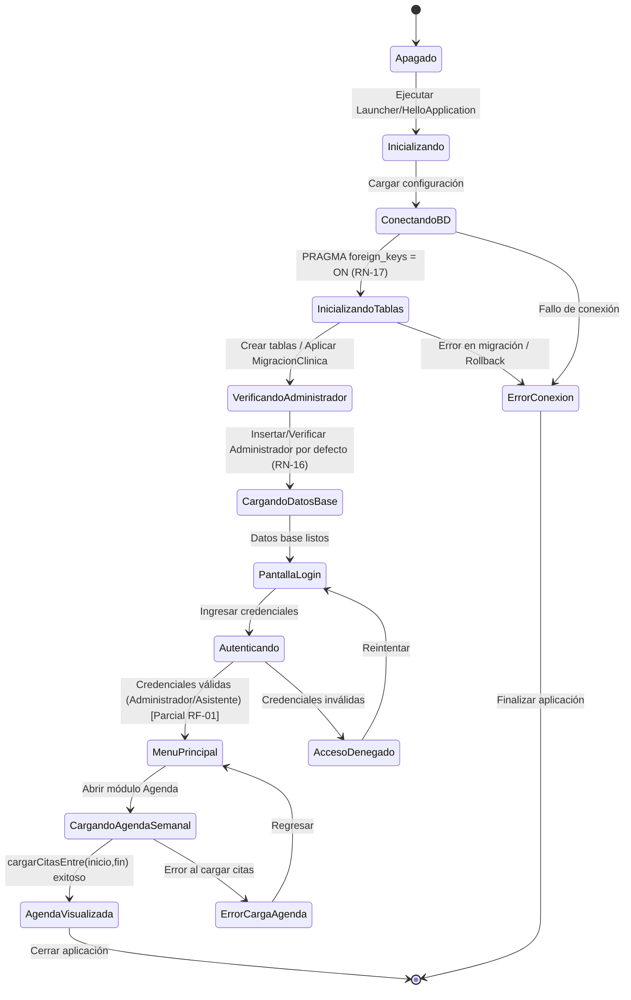

# Diagrama de Estados - S1: Inicio del Sistema, Autenticación de Personal y Carga de Agenda Semanal

```mermaid
stateDiagram-v2
    [*] --> Apagado
    Apagado --> Inicializando : Ejecutar Launcher/HelloApplication
    Inicializando --> ConectandoBD : Cargar configuración
    ConectandoBD --> InicializandoTablas : PRAGMA foreign_keys = ON (RN-17)
    InicializandoTablas --> VerificandoAdministrador : Crear tablas / Aplicar MigracionClinica
    VerificandoAdministrador --> CargandoDatosBase : Insertar/Verificar Administrador por defecto (RN-16)
    CargandoDatosBase --> PantallaLogin : Datos base listos
    PantallaLogin --> Autenticando : Ingresar credenciales
    Autenticando --> MenuPrincipal : Credenciales válidas (Administrador/Asistente) [Parcial RF-01]
    Autenticando --> AccesoDenegado : Credenciales inválidas
    AccesoDenegado --> PantallaLogin : Reintentar
    MenuPrincipal --> CargandoAgendaSemanal : Abrir módulo Agenda
    CargandoAgendaSemanal --> AgendaVisualizada : cargarCitasEntre(inicio,fin) exitoso
    CargandoAgendaSemanal --> ErrorCargaAgenda : Error al cargar citas
    ErrorCargaAgenda --> MenuPrincipal : Regresar
    AgendaVisualizada --> [*] : Cerrar aplicación
    ConectandoBD --> ErrorConexion : Fallo de conexión
    InicializandoTablas --> ErrorConexion : Error en migración / Rollback
    ErrorConexion --> [*] : Finalizar aplicación
```
