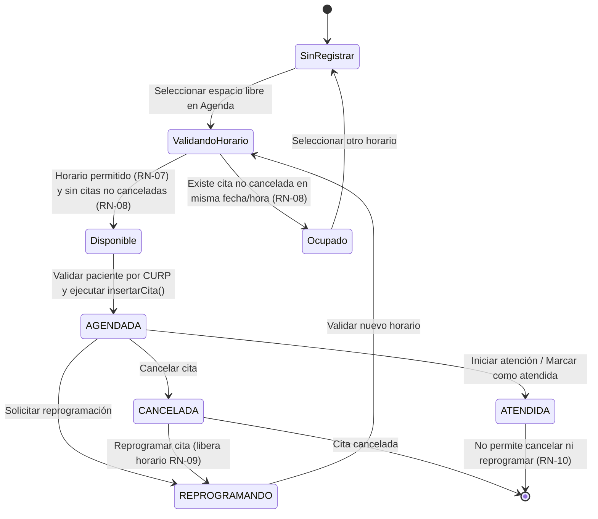

# Diagrama de Estados - S2: Agendamiento, Validación de Horario y Registro de Cita Médica

```mermaid
stateDiagram-v2
    [*] --> SinRegistrar
    SinRegistrar --> ValidandoHorario : Seleccionar espacio libre en Agenda
    ValidandoHorario --> Disponible : Horario permitido (RN-07) y sin citas no canceladas (RN-08)
    ValidandoHorario --> Ocupado : Existe cita no cancelada en misma fecha/hora (RN-08)
    Ocupado --> SinRegistrar : Seleccionar otro horario
    Disponible --> AGENDADA : Validar paciente por CURP y ejecutar insertarCita()
    AGENDADA --> CANCELADA : Cancelar cita
    AGENDADA --> REPROGRAMANDO : Solicitar reprogramación
    REPROGRAMANDO --> ValidandoHorario : Validar nuevo horario
    CANCELADA --> REPROGRAMANDO : Reprogramar cita (libera horario RN-09)
    CANCELADA --> [*] : Cita cancelada
    AGENDADA --> ATENDIDA : Iniciar atención / Marcar como atendida
    ATENDIDA --> [*] : No permite cancelar ni reprogramar (RN-10)
```
