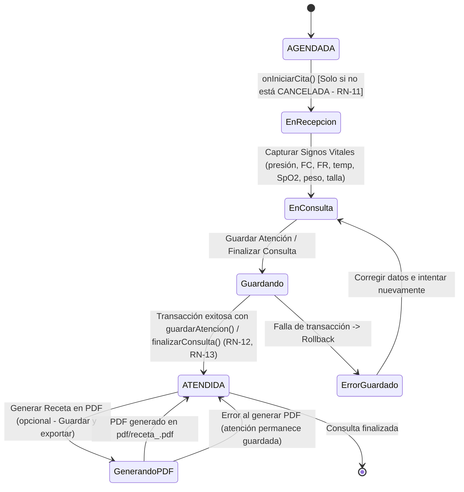

# Diagrama de Estados - S3: Atención de Consulta Médica en Tiempo Real y Generación de Receta en PDF

```mermaid
stateDiagram-v2
    [*] --> AGENDADA
    AGENDADA --> EnRecepcion : onIniciarCita() [Solo si no está CANCELADA - RN-11]
    EnRecepcion --> EnConsulta : Capturar Signos Vitales (presión, FC, FR, temp, SpO2, peso, talla)
    EnConsulta --> Guardando : Guardar Atención / Finalizar Consulta
    Guardando --> ATENDIDA : Transacción exitosa con guardarAtencion() / finalizarConsulta() (RN-12, RN-13)
    Guardando --> ErrorGuardado : Falla de transacción -> Rollback
    ErrorGuardado --> EnConsulta : Corregir datos e intentar nuevamente
    ATENDIDA --> GenerandoPDF : Generar Receta en PDF (opcional - Guardar y exportar)
    GenerandoPDF --> ATENDIDA : PDF generado en pdf/receta_<id>.pdf
    GenerandoPDF --> ATENDIDA : Error al generar PDF (atención permanece guardada)
    ATENDIDA --> [*] : Consulta finalizada
```
