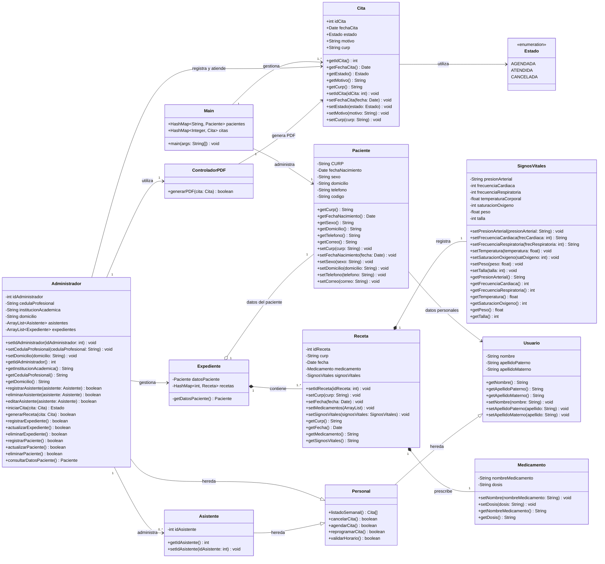

```mermaid
classDiagram
    direction LR

    class Main {
        +HashMap~String, Paciente~ pacientes
        +HashMap~Integer, Cita~ citas
        +main(args: String[]) void
    }

    class Cita {
        +int idCita
        +Date fechaCita
        +Estado estado
        +String motivo
        +String curp
        +getIdCita() int
        +getFechaCita() Date
        +getEstado() Estado
        +getMotivo() String
        +getCurp() String
        +setIdCita(idCita: int) void
        +setFechaCita(fecha: Date) void
        +setEstado(estado: Estado) void
        +setMotivo(motivo: String) void
        +setCurp(curp: String) void
    }

    class Estado {
        <<enumeration>>
        AGENDADA
        ATENDIDA
        CANCELADA
    }

    class Paciente {
        -String CURP
        -Date fechaNacimiento
        -String sexo
        -String domicilio
        -String telefono
        -String codigo
        +getCurp() String
        +getFechaNacimiento() Date
        +getSexo() String
        +getDomicilio() String
        +getTelefono() String
        +getCorreo() String
        +setCurp(curp: String) void
        +setFechaNacimiento(fecha: Date) void
        +setSexo(sexo: String) void
        +setDomicilio(domicilio: String) void
        +setTelefono(telefono: String) void
        +setCorreo(correo: String) void
    }

    class Expediente {
        -Paciente datosPaciente
        -HashMap~int, Receta~ recetas
        -getDatosPaciente() Paciente
    }

    class Receta {
        -int idReceta
        -String curp
        -Date fecha
        -Medicamento medicamento
        -SignosVitales signosVitales
        +setIdReceta(idReceta: int) void
        +setCurp(curp: String) void
        +setFecha(fecha: Date) void
        +setMedicamentos(ArrayList<Medicamento>) void
        +setSignosVitales(signosVitales: SignosVitales) void
        +getCurp() String
        +getFecha() Date
        +getMedicamento() String
        +getSignosVitales() String
    }

    class Medicamento {
        -String nombreMedicamento
        -String dosis
        +setNombre(nombreMedicamento: String) void
        +setDosis(dosis: String) void
        +getNombreMedicamento() String
        +getDosis() String
    }

    class SignosVitales {
        -String presionArterial
        -int frecuenciaCardiaca
        -int frecuenciaRespiratoria
        -float temperaturaCorporal
        -int saturacionOxigeno
        -float peso
        -int talla
        +setPresionArterial(presionArterial: String) void
        +setFrecuenciaCardiaca(frecCardiaca: int) String
        +setFrecuenciaRespiratoria(frecRespiratoria: int) String
        +setTemperatura(temperatura: float) void
        +setSaturacionOxigeno(satOxigeno: int) void
        +setPeso(peso: float) void
        +setTalla(talla: int) void
        +getPresionArterial() String
        +getFrecuenciaCardiaca() int
        +getFrecuenciaRespiratoria() int
        +getTemperatura() float
        +getSaturacionOxigeno() int
        +getPeso() float
        +getTalla() int
    }

    class Usuario {
        -String nombre
        -String apellidoPaterno
        -String apellidoMaterno
        +getNombre() String
        +getApellidoPaterno() String
        +getApellidoMaterno() String
        +setNombre(nombre: String) void
        +setApellidoPaterno(apellido: String) void
        +setApellidoMaterno(apellido: String) void
    }

    class Personal {
        +listadoSemanal() Cita[]
        +cancelarCita() boolean
        +agendarCita() boolean
        +reprogramarCita() boolean
        +validarHorario() boolean
    }

    class Administrador {
        -int idAdministrador
        -String cedulaProfesional
        -String institucionAcademica
        -String domicilio
        -ArrayList~Asistente~ asistentes
        -ArrayList~Expediente~ expedientes
        +setIdAdministrador(idAdministrador: int) void
        +setCedulaProfesional(cedulaProfesional: String) void
        +setDomicilio(domicilio: String) void
        +getIdAdministrador() int
        +getInstitucionAcademica() String
        +getCedulaProfesional() String
        +getDomicilio() String
        +registrarAsistente(asistente: Asistente) boolean
        +eliminarAsistente(asistente: Asistente) boolean
        +editarAsistente(asistente: Asistente) boolean
        +iniciarCita(cita: Cita) Estado
        +generarReceta(cita: Cita) boolean
        +registrarExpediente() boolean
        +actualizarExpediente() boolean
        +eliminarExpediente() boolean
        +registrarPaciente() boolean
        +actualizarPaciente() boolean
        +eliminarPaciente() boolean
        +consultarDatosPaciente() Paciente
    }

    class Asistente {
        -int idAsistente
        +getIdAsistente() int
        +setIdAsistente(idAsistente: int) void
    }

    class ControladorPDF {
        +generarPDF(cita: Cita) boolean
    }

    Main "1" --> "1..*" Paciente : administra
    Main "1" --> "1..*" Cita : gestiona
    Cita --> Estado : utiliza

    Expediente "1" o-- "1" Paciente : datos del paciente
    Expediente "1" *-- "1..*" Receta : contiene
    Receta "1" *-- "1" Medicamento : prescribe
    Receta "1" *-- "1" SignosVitales : registra

    Paciente --> Usuario : datos personales
    Personal --|> Usuario : hereda
    Administrador --|> Personal : hereda
    Asistente --|> Personal : hereda

    Administrador "1" --> "0..*" Asistente : administra
    Administrador --> Expediente : gestiona
    Administrador --> Cita : registra y atiende
    Administrador "1" --> "1" ControladorPDF : utiliza
    ControladorPDF --> Cita : genera PDF
```