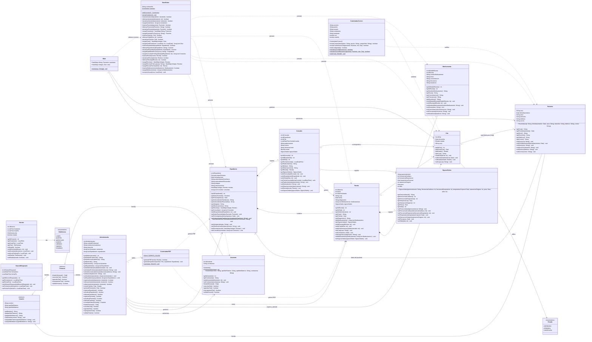

```mermaid
classDiagram
    direction LR

    class Main {
        +HashMap~String, Paciente~ pacientes
        +HashMap~Integer, Cita~ citas
        +main(args: String[])$ void
    }

    class Cita {
        +int idCita
        +Date fechaCita
        +Estado estado
        +String curp
        +getIdCita() int
        +getFechaCita() Date
        +getEstado() Estado
        +getCurp() String
        +setIdCita(idCita: int) void
        +setFechaCita(fechaCita: Date) void
        +setEstado(estado: Estado) void
        +setCurp(curp: String) void
    }

    class Estado {
        <<enumeration>>
        AGENDADA
        ATENDIDA
        CANCELADA
    }

    class DiaSemana {
        <<enumeration>>
        LUNES
        MARTES
        MIERCOLES
        JUEVES
        VIERNES
        SABADO
        DOMINGO
    }

    class Horario {
        -int idHorario
        -LocalTime horaInicio
        -LocalTime horaFin
        -DiaSemana dia
        -boolean estado
        +getIdHorario() int
        +getHoraInicio() LocalTime
        +getHoraFin() LocalTime
        +getDia() DiaSemana
        +isEstado() boolean
        +setIdHorario(idHorario: int) void
        +setHoraInicio(horaInicio: LocalTime) void
        +setHoraFin(horaFin: LocalTime) void
        +setDia(dia: DiaSemana) void
        +setEstado(estado: boolean) void
    }

    class HorarioBloqueado {
        -int idHorarioBloqueado
        -LocalDateTime fechaInicio
        -LocalDateTime fechaFin
        +getIdHorarioBloqueado() int
        +getFechaInicio() LocalDateTime
        +getFechaFin() LocalDateTime
        +setIdHorarioBloqueado(idHorarioBloqueado: int) void
        +setFechaInicio(fechaInicio: LocalDateTime) void
        +setFechaFin(fechaFin: LocalDateTime) void
    }

    class Paciente {
        -String curp
        -Date fechaNacimiento
        -String sexo
        -String domicilio
        -String telefono
        -String correo
        +Paciente(curp: String, fechaNacimiento: Date, sexo: String, domicilio: String, telefono: String, correo: String)
        +getCurp() String
        +getFechaNacimiento() Date
        +getSexo() String
        +getDomicilio() String
        +getTelefono() String
        +getCorreo() String
        +setCurp(curp: String) void
        +setFechaNacimiento(fechaNacimiento: Date) void
        +setSexo(sexo: String) void
        +setDomicilio(domicilio: String) void
        +setTelefono(telefono: String) void
        +setCorreo(correo: String) void
    }

    class Expediente {
        -int idExpediente
        -Paciente datosPaciente
        -Date fechaApertura
        -String antecedentesFamiliares
        -String antecedentesPersonales
        -String alergias
        -String observaciones
        -HashMap~Integer, Receta~ recetas
        -ArrayList~Consulta~ consultas
        +getIdExpediente() int
        +getDatosPaciente() Paciente
        +getFechaApertura() Date
        +getAntecedentesFamiliares() String
        +getAntecedentesPersonales() String
        +getAlergias() String
        +getObservaciones() String
        +getRecetas() HashMap~Integer, Receta~
        +getConsultas() ArrayList~Consulta~
        +setIdExpediente(idExpediente: int) void
        +setDatosPaciente(datosPaciente: Paciente) void
        +setFechaApertura(fechaApertura: Date) void
        +setAntecedentesFamiliares(antecedentesFamiliares: String) void
        +setAntecedentesPersonales(antecedentesPersonales: String) void
        +setAlergias(alergias: String) void
        +setObservaciones(observaciones: String) void
        +setRecetas(recetas: HashMap~Integer, Receta~) void
        +setConsultas(consultas: ArrayList~Consulta~) void
    }

    class Consulta {
        -int idConsulta
        -int idExpediente
        -int idCita
        -LocalDateTime fechaConsulta
        -String padecimiento
        -String motivo
        -String observaciones
        -Receta receta
        -SignosVitales signosVitales
        +getIdConsulta() int
        +getIdExpediente() int
        +getIdCita() int
        +getFechaConsulta() LocalDateTime
        +getPadecimiento() String
        +getMotivo() String
        +getObservaciones() String
        +getReceta() Receta
        +getSignosVitales() SignosVitales
        +setIdConsulta(idConsulta: int) void
        +setIdExpediente(idExpediente: int) void
        +setIdCita(idCita: int) void
        +setFechaConsulta(fechaConsulta: LocalDateTime) void
        +setPadecimiento(padecimiento: String) void
        +setMotivo(motivo: String) void
        +setObservaciones(observaciones: String) void
        +setReceta(receta: Receta) void
        +setSignosVitales(signosVitales: SignosVitales) void
    }

    class Receta {
        -int idReceta
        -int idCita
        -int idAdministrador
        -String curp
        -Date fecha
        -String diagnostico
        -ArrayList~Medicamento~ medicamentos
        -SignosVitales signosVitales
        +getIdReceta() int
        +getIdCita() int
        +getIdAdministrador() int
        +getCurp() String
        +getFecha() Date
        +getDiagnostico() String
        +getMedicamentos() ArrayList~Medicamento~
        +getSignosVitales() SignosVitales
        +setIdReceta(idReceta: int) void
        +setIdCita(idCita: int) void
        +setIdAdministrador(idAdministrador: int) void
        +setCurp(curp: String) void
        +setFecha(fecha: Date) void
        +setDiagnostico(diagnostico: String) void
        +setMedicamentos(medicamentos: ArrayList~Medicamento~) void
        +setSignosVitales(signosVitales: SignosVitales) void
    }

    class Medicamento {
        -int idDetalleReceta
        -int idReceta
        -String nombreMedicamento
        -String dosis
        -String concentracion
        -String frecuencia
        -String duradcion
        +getIdDetalleReceta() int
        +getIdReceta() int
        +getNombreMedicamento() String
        +getDosis() String
        +getConcentracion() String
        +getFrecuencia() String
        +getDuradcion() String
        +setIdDetalleReceta(idDetalleReceta: int) void
        +setIdReceta(idReceta: int) void
        +setNombreMedicamento(nombreMedicamento: String) void
        +setDosis(dosis: String) void
        +setConcentracion(concentracion: String) void
        +setFrecuencia(frecuencia: String) void
        +setDuradcion(duradcion: String) void
    }

    class SignosVitales {
        -String presionArterial
        -int frecuenciaCardiaca
        -int frecuenciaRespiratoria
        -float temperaturaCorporal
        -int saturacionOxigeno
        -float peso
        -int talla
        +SignosVitales(presionArterial: String, frecuenciaCardiaca: int, frecuenciaRespiratoria: int, temperaturaCorporal: float, saturacionOxigeno: int, peso: float, talla: int)
        +getPresionArterial() String
        +getFrecuenciaCardiaca() int
        +getFrecuenciaRespiratoria() int
        +getTemperatura() float
        +getSaturacionOxigeno() int
        +getPeso() float
        +getTalla() int
        +setPresionArterial(presionArterial: String) void
        +setFrecuenciaCardiaca(frecuenciaCardiaca: int) void
        +setFrecuenciaRespiratoria(frecuenciaRespiratoria: int) void
        +setTemperatura(temperaturaCorporal: float) void
        +setSaturacionOxigeno(saturacionOxigeno: int) void
        +setPeso(peso: float) void
        +setTalla(talla: int) void
    }

    class Usuario {
        <<abstract>>
        -String nombre
        -String apellidoPaterno
        -String apellidoMaterno
        +getNombre() String
        +getApellidoPaterno() String
        +getApellidoMaterno() String
        +setNombre(nombre: String) void
        +setApellidoPaterno(apellidoPaterno: String) void
        +setApellidoMaterno(apellidoMaterno: String) void
    }

    class Personal {
        <<abstract>>
        +listadoSemanal()* Cita[]
        +cancelarCita()* boolean
        +agendarCita()* boolean
        +reprogramarCita()* boolean
        +validarHorario()* boolean
    }

    class Administrador {
        -int idAdministrador
        -String cedulaProfesional
        -String institucionAcademica
        -String domicilio
        -ArrayList~Asistente~ asistentes
        -ArrayList~Expediente~ expedientes
        +getIdAdministrador() int
        +getCedulaProfesional() String
        +getInstitucionAcademica() String
        +getDomicilio() String
        +getAsistentes() ArrayList~Asistente~
        +getExpedientes() ArrayList~Expediente~
        +setIdAdministrador(idAdministrador: int) void
        +setCedulaProfesional(cedulaProfesional: String) void
        +setInstitucionAcademica(institucionAcademica: String) void
        +setDomicilio(domicilio: String) void
        +setAsistentes(asistentes: ArrayList~Asistente~) void
        +setExpedientes(expedientes: ArrayList~Expediente~) void
        +registrarAsistente(asistente: Asistente) boolean
        +eliminarAsistente(asistente: Asistente) boolean
        +editarAsistente(asistente: Asistente) boolean
        +iniciarCita(cita: Cita) Estado
        +generarReceta(cita: Cita) boolean
        +registrarExpediente() boolean
        +actualizarExpediente() boolean
        +eliminarExpediente() boolean
        +registrarPaciente() boolean
        +actualizarPaciente() boolean
        +eliminarPaciente() boolean
        +consultarDatosPaciente() Paciente
        +listadoSemanal() Cita[]
        +cancelarCita() boolean
        +agendarCita() boolean
        +reprogramarCita() boolean
        +validarHorario() boolean
    }

    class Asistente {
        -int idAsistente
        -String contrasena
        +Asistente()
        +Asistente(idAsistente: int)
        +Asistente(nombre: String, apellidoPaterno: String, apellidoMaterno: String, contrasena: String)
        +getIdAsistente() int
        +getContrasena() String
        +setIdAsistente(idAsistente: int) void
        +setContrasena(contrasena: String) void
        +listadoSemanal() Cita[]
        +cancelarCita() boolean
        +agendarCita() boolean
        +reprogramarCita() boolean
        +validarHorario() boolean
    }

    class BaseDatos {
        -String contraseña
        -Connection conexion$
        +getConexion()$ Connection
        +cerrarConexion()$ void
        +insertarAsistente(asistente: Asistente) boolean
        +eliminarAsistente(idAsistente: int) boolean
        +actualizarAsistente(asistente: Asistente) boolean
        +cargarAsistentes() ArrayList~Asistente~
        +insertarPaciente(paciente: Paciente) boolean
        +eliminarPaciente(idPaciente: String) boolean
        +actualizarPaciente(paciente: Paciente) boolean
        +cargarPacientes() HashMap~String, Paciente~
        +cargarPacientePorCurp(curp: String) Paciente
        +insertarCita(cita: Cita) boolean
        +eliminarCita(idCita: int) boolean
        +actualizarCita(cita: Cita) boolean
        +cargarCitas() HashMap~Integer, Cita~
        +cargarCitasEntre(inicio: LocalDate, fin: LocalDate) ArrayList~Cita~
        +insertarExpediente(expediente: Expediente) boolean
        +eliminarExpediente(idExpediente: String) boolean
        +actualizarExpediente(expediente: Expediente) boolean
        +cargarExpedientePorCurp(curp: String) Expediente
        +cargarConsultasPorExpediente(idExpediente: int) ArrayList~Consulta~
        +insertarReceta(receta: Receta) boolean
        +actualizarReceta(receta: Receta) boolean
        +eliminarReceta(idReceta: int) boolean
        +cargarRecetas() HashMap~Integer, Receta~
        +cargarRecetasPorCurp(curp: String) HashMap~Integer, Receta~
        +cargarRecetaPorCita(idCita: int) Receta
        +insertarMedicamento(medicamento: Medicamento) boolean
        +cargarMedicamentos() ArrayList~Medicamento~
        +convertirHoras(hora: LocalTime) void
    }

    class ControladorPDF {
        +String CARPETA_SALIDA$
        +generarPDF(receta: Receta) boolean
        +generarExpediente(archivo: File, expediente: Expediente) void
        +main(args: String[])$ void
    }

    class ControladorCorreo {
        -String servidor
        -String puerto
        -String usuario
        -String contrasena
        -String remitente
        -boolean ssl
        -boolean starttls
        +ControladorCorreo()
        +enviarCorreo(destinatario: String, asunto: String, cuerpoHtml: String) boolean
        +enviarConfirmacionCita(paciente: Paciente, cita: Cita) boolean
        +estaConfigurado() boolean
        +mandarCorreoElectronico()$ boolean
        +mandarCorreoElectronico(paciente: Paciente, cita: Cita)$ boolean
        +main(args: String[])$ void
    }

    Main "1" --> "1..*" Paciente : administra
    Main "1" --> "1..*" Cita : gestiona
    Main ..> BaseDatos : obtiene conexion
    Cita --> Estado : utiliza
    Cita "0..*" --> "1" Paciente : agendada para (curp)
    Horario --> DiaSemana : dia

    Expediente "1" o-- "1" Paciente : datos del paciente
    Expediente "1" *-- "0..*" Receta : contiene
    Expediente "1" *-- "0..*" Consulta : registra
    Consulta "1" --> "0..1" Receta : genera
    Consulta "1" --> "0..1" SignosVitales : registra
    Consulta "0..*" --> "1" Cita : corresponde a
    Receta "1" *-- "0..*" Medicamento : prescribe
    Receta "1" *-- "1" SignosVitales : registra
    Receta "0..1" --> "1" Cita : pertenece a

    Usuario <|-- Paciente : hereda
    Usuario <|-- Personal : hereda
    Personal <|-- Administrador : hereda
    Personal <|-- Asistente : hereda

    Administrador "1" --> "0..*" Asistente : administra
    Administrador "1" --> "0..*" Expediente : gestiona
    Administrador --> Cita : registra y atiende
    Administrador "1" --> "0..*" Receta : emite
    Administrador "1" --> "1" ControladorPDF : utiliza

    BaseDatos ..> Asistente : persiste
    BaseDatos ..> Paciente : persiste
    BaseDatos ..> Cita : persiste
    BaseDatos ..> Expediente : persiste
    BaseDatos ..> Receta : persiste
    BaseDatos ..> Medicamento : persiste

    ControladorPDF ..> Receta : genera PDF
    ControladorPDF ..> Expediente : genera PDF
    ControladorCorreo ..> Paciente : notifica
    ControladorCorreo ..> Cita : confirma
```
